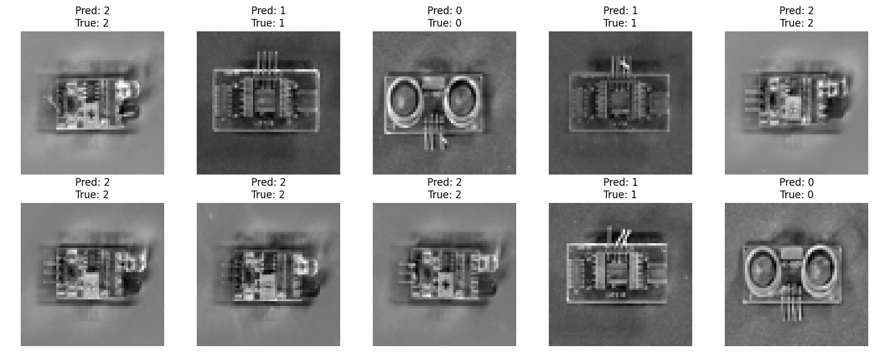

[](http://quantlet.de/)

## [](http://quantlet.de/) **Electric Classification** [](http://quantlet.de/)

```yaml

Name of QuantLet : 'Electric Classification'

Published in : 'Industrial Picture Classification via SVM' 

Description : 'This is a short quantlet to classify pictures of electric applicances'

Keywords : 'cv, SVM, classification'

Author : 'WK Haerdle Zuo Xiaorui'

Submitted : Tue, Feb 20 2024

```



### [IPYNB Code: Electric Classification.ipynb](Electric Classification.ipynb)


automatically created on 2024-02-20